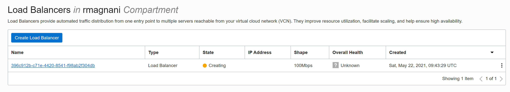

# HOL1: Istallazione dell'applicazione via *helm*

## Prerequisiti

I seguenti tool devono essere installato sulla macchina client:

- `helm`
- `git`

> NB: OCI Cloud Shell ha già installato questo software.

<br/>

## Clone del repository

Si effettua il clone del repository del workshop:

```bash
git clone https://github.com/riccardomagnani/demo_OKE_base.git
```


## Istallazione dell'applicazione microservices sample

Per evitare i warning di sicurezza di helm si cambia i diritti di accesso del file config di kubernetes:

```bash
chmod 400 ~/.kube/config
```

<br/>

Volendo si può aprire una shell e controllare il comportamento del cluster durante la fase di installazione dell'app:

```bash
watch -n 1 kubectl get po -n core-services -o wide
```

<br/>

Si usa `helm` per istallare l'applicazione "microservices sample":

```bash
cd ~/demo_OKE_base/handson_1/

helm install sample-app k8s_sample-microservices-app/ --values k8s_sample-microservices-app/values.yaml --namespace sample-app --create-namespace
```

L'applicazione installa anche un servizio di tipo LoadBalancer accessibile da Internet visualizzabile con questo comando:

```bash
kubectl get svc -n main-app
```

Si può vedere anche dalla OCI Console la creazione del LoadBalancer collegato al servizio Kubernetes:



<br/>

Quando l'installazione della applicazione sarà completata (pochi secondi dopo il lancio del comando `helm`) si può prendere IP del servizio con il seguente comando:

```bash
export SAMPLE_APP_SERVICE_IP=$(kubectl get svc --namespace main-app frontend-ui-service -o jsonpath='{.status.loadBalancer.ingress[0].ip}')

echo $SAMPLE_APP_SERVICE_IP
```

<br/>

L'applicazione può essere testata con il seguente comando o via Browser:

```bash
export URL_APP="http://$SAMPLE_APP_SERVICE_IP/LoadOKE/TestOKEService?servlist=email-service.core-services.svc.cluster.local:8080,pdf-generation-service.core-services.svc.cluster.local:8080,digitalsignchecker-service.core-services.svc.cluster.local:8080&threadnum=5,5,5&elabtime=100,100,100&errperc=10,5,10"

echo $URL_APP

curl $URL_APP
```

### HOL1.1 Aggiornamento della sample applicationv via *helm* (optional)

The values used for the installation can be modified here:

```bash
cd ~/demo_OKE_base/handson_1/k8s_sample-microservices-app

vim values.yaml
```

For instance you can change the following parameters:

```yaml
pdfGeneration:
...
  horizontalPodAutoscaler:
    spec:
      minReplicas: 5
      maxReplicas: 20
```

Check the pdfGeneration `horizontalPodAutoscaler` before applying the change to the cluster:

```bash
kubectl get horizontalPodAutoscaler -n core-services
```

As you can see all the horizontalPodAutoscaler (HPA) in the core-services has the same value therefore the same ability to scale.

To check the HPA size also look at KubeView (choose the name space named "core-services" in the input box at the top). If you opened KubeView before installing sample application, then you need to refresh the whole page (F5 on Windows or Control-R on Mac) as the namespace "core-services" is not loaded.

Then deploy an update using the following helm command:

```bash
helm upgrade sample-app k8s_sample-microservices-app/ --namespace sample-app --values k8s_sample-microservices-app/values.yaml
```

Check again:

```bash
kubectl get horizontalPodAutoscaler -n core-services
```

<br/>
