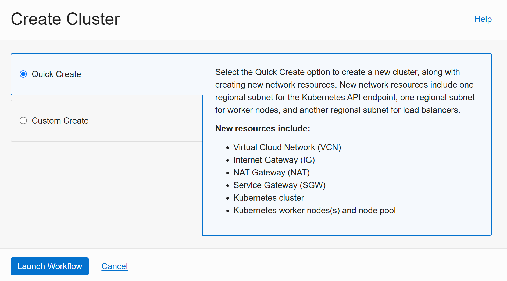
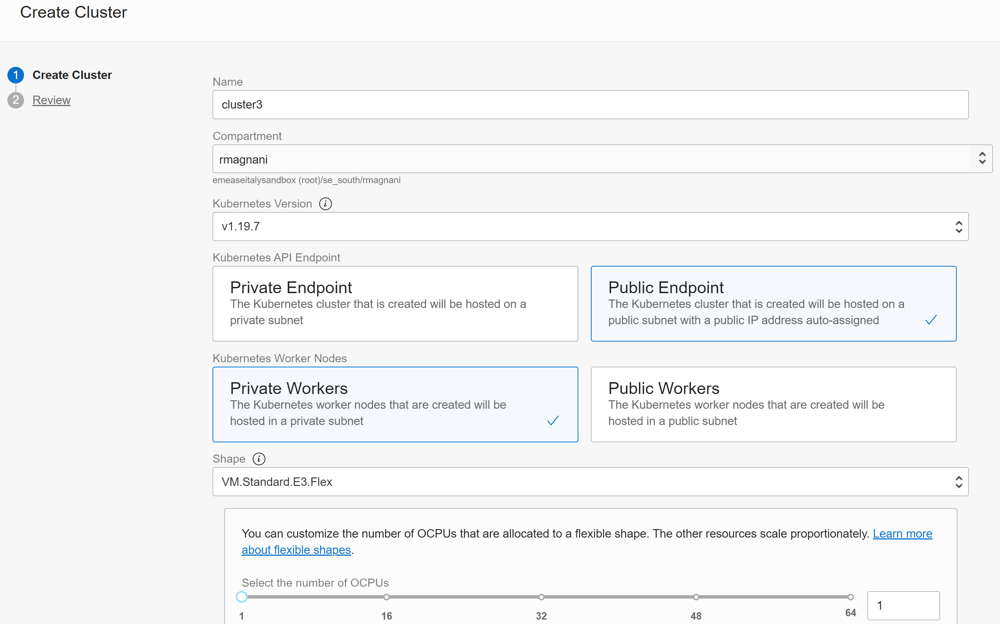
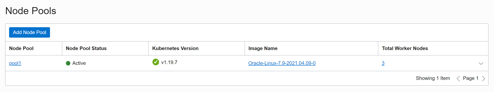
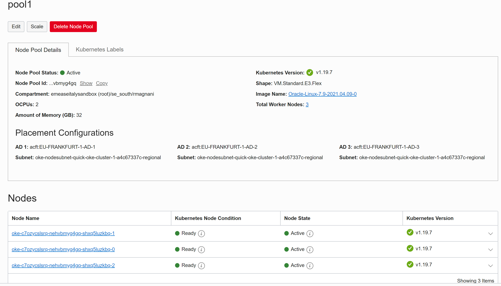
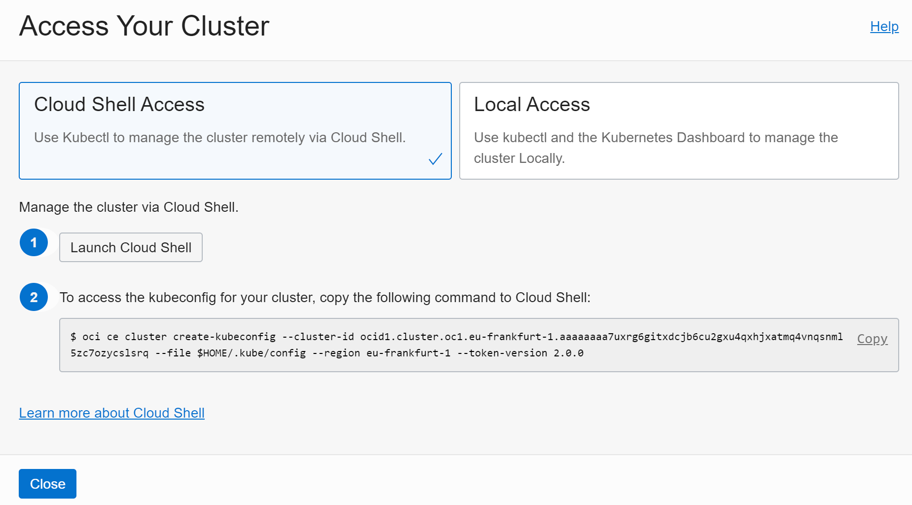
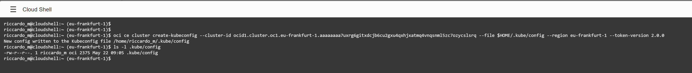
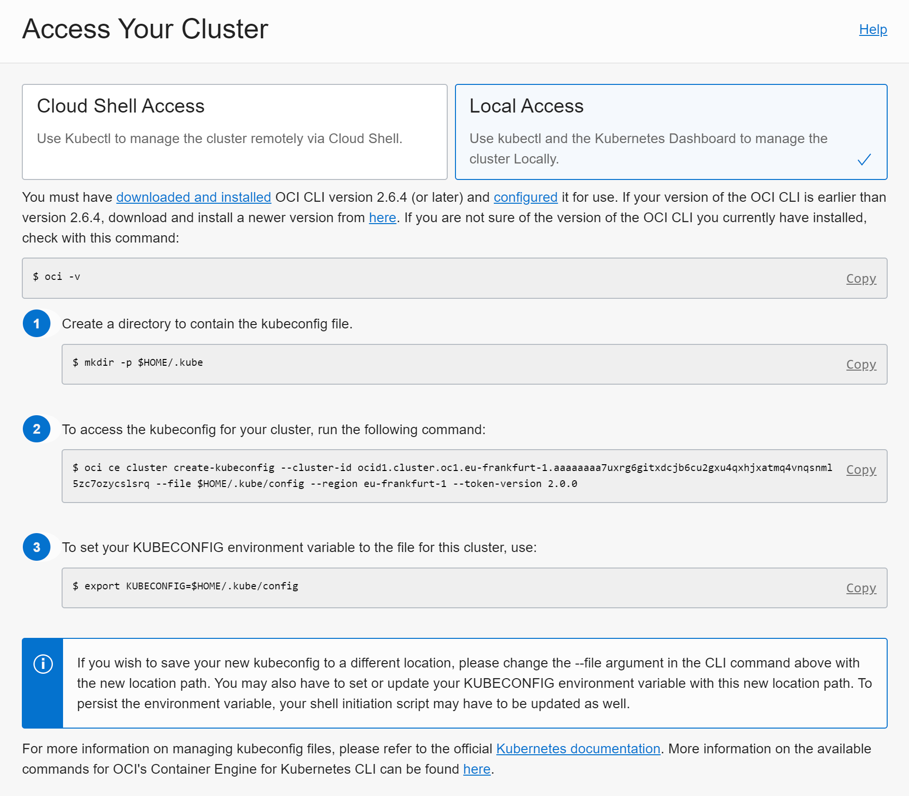
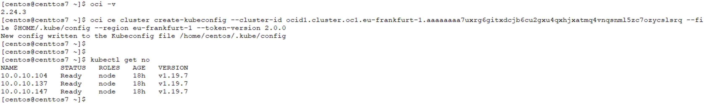
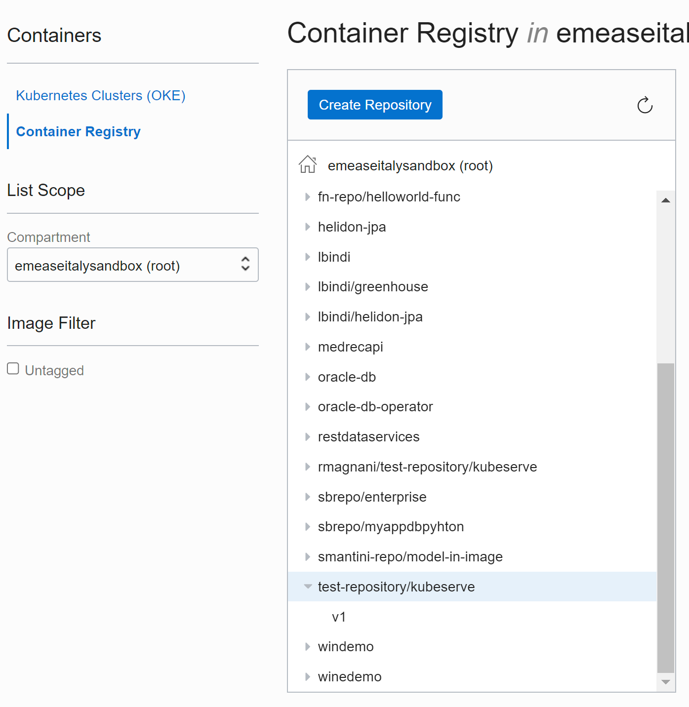

# Demo OKE

## Indice

- [HOL1: Istallazione dell'applicazione via *helm*](HOL1.md) 

HOL2: Stress test e Kubeview

HOL3: Rolling update / Rollback & protezione dagli errori (probes)

<br/>

## Creazione di un cluster OKE con QuickStart

Ad esempio si usa il Quickstart per creare il cluster:



<br/>

Poi si impostano le caratteristiche del cluster e si imposta una chiave pubblica per accedere ai nodi:



<br/>

## Presentazione della struttura interna al cluster da console

Lista dei Node Pools:



Dettaglio del Node Pool:



<br/>

## Collegamento al cluster da OCI Cloud Shell e da external bash shell

Si preme il bottone Access Cluster disponibile all'interno del dettaglio del Cluster OKE:

### OCI Cloud Shell

Si accede alla cloud shell direttamente dal browser:



Si configura la cloud shell:



<br/>

### Extenal bash shell

#### Prerequisiti

Sulla macchine cliente deve essere installato:

- OCI CLI

- `kubectl`

> NB: OCI Cloud Shell ha già installato questo software.

<br/>

Utilizzando una bastion host o una macchina Linux (volendo anche con Windows), si utilizza l'accesso local access:



Si configuro la macchina locale per accedere al cluster OKE:



<br/>

## k9s

### Prerequisiti

Il seguente software deve essere installato sulla macchina client

- `k9s`

<br/>

Si visualizza i componenti Kubernetes installati nel cluster con **k9s**:

```bash
~/k9s
```

Una volta dentro l'applicazione si usano i seguenti comandi per vedere i diversi componenti di k8s:

```bash
:ns

:pod

:deploy

:service

:sts

:pv

:pvc

...
```


## OCIR

### Prerequisiti

Il seguente software deve essere installato sulla macchina client

- Docker

> NB: OCI Cloud Shell ha già installato questo software.

<br/>

Si scarica una immagine pubblica, ad esempio:

```bash
docker pull rmagnani/kubeserve:v1
```

Si fa il login su OCIR:

```bash
docker login fra.ocir.io/emeaseitalysandbox -u 'emeaseitalysandbox/oracleidentitycloud/<email-address>'
```

Come password si usa il token generato da OCI nella sezione:

`Identity / Users / <utente> / Auth Tokens`

Si può "taggare" l'immagine appena scaricata:

```bash
docker tag rmagnani/kubeserve:v1 fra.ocir.io/emeaseitalysandbox/test-repository/kubeserve:v1
```

Poi si fa il push dell'immagine su OCIR nel repository con nome *test-repository*:

```bash
docker push fra.ocir.io/emeaseitalysandbox/test-repository/kubeserve:v1
```

Si controlla poi che l'immagine sia stata salvata nel repository (root compartment) ed eventualmente si sposta su un compartment diverso per motivi di policy.



<br/>

## HOL1: Istallazione dell'applicazione via *helm*

Prerequisiti

I seguenti tool devono essere installato sulla macchina client:

- `helm`
- `git`

> NB: OCI Cloud Shell ha già installato questo software.

<br/>

### Clone del repository

Si effettua il clone del repository del workshop:

**AAAAAAAAAAAAAAAAAAAAAAAAAAAAAAAAAAA**


### Istallazione dell'applicazione microservices sample

Per evitare i warning di sicurezza di helm si cambia i diritti di accesso del file config di kubernetes:

```bash
chmod 400 ~/.kube/config
```

<br/>

Volendo si può aprire una shell e controllare il comportamento del cluster durante la fase di installazione dell'app:

```bash
watch -n 1 kubectl get po -n core-services -o wide
```

<br/>

Si usa `helm` per istallare l'applicazione "microservices sample":

```bash
cd ~/demo_OKE_base/handson_1/

helm install sample-app k8s_sample-microservices-app/ --values k8s_sample-microservices-app/values.yaml --namespace sample-app --create-namespace
```

L'applicazione installa anche un servizio di tipo LoadBalancer accessibile da Internet visualizzabile con questo comando:

```bash
kubectl get svc -n main-app
```

Si può vedere anche dalla OCI Console la creazione del LoadBalancer collegato al servizio Kubernetes:


<br/>

Quando l'installazione della applicazione sarà completata (pochi secondi dopo il lancio del comando `helm`) si può prendere IP del servizio con il seguente comando:

```bash
export SAMPLE_APP_SERVICE_IP=$(kubectl get svc --namespace main-app frontend-ui-service -o jsonpath='{.status.loadBalancer.ingress[0].ip}')

echo $SAMPLE_APP_SERVICE_IP
```

<br/>

L'applicazione può essere testata con il seguente comando o via Browser:

```bash
export URL_APP="http://$SAMPLE_APP_SERVICE_IP/LoadOKE/TestOKEService?servlist=email-service.core-services.svc.cluster.local:8080,pdf-generation-service.core-services.svc.cluster.local:8080,digitalsignchecker-service.core-services.svc.cluster.local:8080&threadnum=5,5,5&elabtime=100,100,100&errperc=10,5,10"

echo $URL_APP

curl $URL_APP
```

### HOL1.1 Aggiornamento della sample applicationv via *helm* (optional)

The values used for the installation can be modified here:

```bash
cd ~/demo_OKE_base/handson_1/k8s_sample-microservices-app

vim values.yaml
```

For instance you can change the following parameters:

```yaml
pdfGeneration:
...
  horizontalPodAutoscaler:
    spec:
      minReplicas: 5
      maxReplicas: 20
```

Check the pdfGeneration `horizontalPodAutoscaler` before applying the change to the cluster:

```bash
kubectl get horizontalPodAutoscaler -n core-services
```

As you can see all the horizontalPodAutoscaler (HPA) in the core-services has the same value therefore the same ability to scale.

To check the HPA size also look at KubeView (choose the name space named "core-services" in the input box at the top). If you opened KubeView before installing sample application, then you need to refresh the whole page (F5 on Windows or Control-R on Mac) as the namespace "core-services" is not loaded.

Then deploy an update using the following helm command:

```bash
helm upgrade sample-app k8s_sample-microservices-app/ --namespace sample-app --values k8s_sample-microservices-app/values.yaml
```

Check again:

```bash
kubectl get horizontalPodAutoscaler -n core-services
```

<br/>

## HOL2: Stress test e Kubeview

### Prerequisiti

Sul cluster deve essere installato:

- `siege` (è una applicazione linux)

- metric server

- kubeview

Maggiori info di seguito:

#### metric server

```bash
kubectl apply -f https://github.com/kubernetes-sigs/metrics-server/releases/download/v0.4.4/components.yaml
```

Per verificare:

```bash
k8s_sample-microservices-app]$ kubectl rollout status deploy metrics-server -n kube-system
deployment "metrics-server" successfully rolled out
```

Dopo l'installazione del metric server si puo controllare l'impegno di risorse dei nodi e dei pod:

```bash
kubectl top no
kubectl top po -A
```

#### Kubeview

```bash
git clone https://github.com/riccardomagnani/kubeview

helm install kubeview kubeview/deployments/helm/kubeview -f ./kubeview/deployments/helm/myvalues-sample.yaml --namespace kubeview --create-namespace
```

Verifica:

```bash
export SERVICE_IP=$(kubectl get svc --namespace kubeview kubeview -o jsonpath='{.status.loadBalancer.ingress[0].ip}')

echo http://$SERVICE_IP
```

Si usa il browser per vedere Kubeview.

<br/>

Si apre una shell per monitorare il comportamento del cluster:

```bash
watch -n 1 "kubectl top no && kubectl get hpa,po -n core-services"

kubectl get po,svc -n main-app
watch -n 1 kubectl top po -n core-services
watch kubectl get hpa,po,svc -n core-services
```

Si esegue il seguente comando per iniettare del carico nell'applicazione sample.

```bash
export SERVICE_IP=$(kubectl get svc --namespace main-app frontend-ui-service -o jsonpath='{.status.loadBalancer.ingress[0].ip}')

echo $SERVICE_IP

siege -c 10 -r 10000 "http://$SERVICE_IP/LoadOKE/TestOKEService?servlist=email-service.core-services.svc.cluster.local:8080,pdf-generation-service.core-services.svc.cluster.local:8080,digitalsignchecker-service.core-services.svc.cluster.local:8080&threadnum=5,5,5&elabtime=100,100,100&errperc=10,5,10"
```

Utilizzando k9s si possono vedere i dei pod.

Quando il deployment ha raggiunto le dimensioni massime il siege può essere fermato con Ctrl+C.

<br/>

### Cancellazione dell'applicazione via helm

Per cancellare l'applicazione si usa il seguente comando:

```bash
helm uninstall sample-app -n sample-app
```

<br/>

## HOL3: Rolling update / Rollback & protezione dagli errori (probes)

### Rolling update / rollback

#### Prima istallazione

Si installa una applicazione`Generic-Microservice` composta da:

1. un deployment (che referenzia una immagine in versione 1)
2. il relativo service di tipo: LoadBalancer

Si usano questi comandi:

```bash
cd ~/demo_OKE_base/handson_3

kubectl get po,svc

kubectl apply -f generic-microservice-nochecks.yaml

kubectl get po,svc
```

Si testa il generic-microservice deployment mandandogli un carico costante:

```bash
export GENERIC_MICRO_SERVICE_IP=$(kubectl get svc --namespace default generic-microservice -o jsonpath='{.status.loadBalancer.ingress[0].ip}')
echo $GENERIC_MICRO_SERVICE_IP

while true; do curl http://$GENERIC_MICRO_SERVICE_IP; sleep 0.5;done
```

Si mantiene il loop che mostra la versione dell'immagine in esecuzione nel pod. Si può verificare che il servizio bilancia sui vari pod perché nella risposta viene mostrato il hostname del pod che risponde alla chiamata.

<br/>

#### Scaling manuale

Teniamo monitorato il compontamento del cluster con il comando seguente mentre si fanno altre operazioni:

```bash
watch -n 1 kubectl get po,svc
```

Usando un'altra shell si può ad esempio scalare manualmente il numero dei pod sotto il deployment.

```bash
kubectl scale deployment --replicas=10 generic-microservice
```

#### Aggiornamento dell'applicazione

Adesso procediamo con l'aggiornamento della versione applicativa cambiando l'immagine dentro il deployment e usando rolling update strategy:

```bash
kubectl set image deploy generic-microservice app=rmagnani/kubeserve:v2 --record
```

Si verifica lo status del deployment con questo comando:

```bash
kubectl rollout history deployment generic-microservice
```

Il loop mostra che il rilascio applicativo non ha dato alcun disservizio.

<br/>

Adesso facciamo un aggiornamento ad una versione **errata**.

```bash
kubectl set image deploy generic-microservice app=rmagnani/kubeserve:error --record
```

Il loop mostra il problema applicativo e l'utente finale sta avendo disservizio.

Si fa il roll-back applicativo alla versione precedente al rilascio:

```bash
kubectl rollout undo deployment generic-microservice
```

<br/>

### Exploit probing

Mantenere la shell con il loop attivo.

Si usa una versione di deployment con delle probe`generic-microservice-checks.yaml`:

...

```yaml
...
    readinessProbe:
      httpGet:
        path: /
        port: 80
        scheme: HTTP
      initialDelaySeconds: 1
    livenessProbe:
      httpGet:
        path: /
        port: 80
        scheme: HTTP
...
```

Si applica:

```bash
cd ~/demo_OKE_base/handson_3

kubectl apply -f generic-microservice-checks.yaml
```

Sono state aggiunte le sond di Readiness e Liveness.

<br/>

Se adesso si imposta di nuovo l'immagine con l'errore si vede che i nuovi pod non diventano mai live perché non superano il probing readiness perché non tornano 200.

Si apre un shell e si usa questo comando per monitorare il rilascio:

```bash
watch -n 1 kubectl get po,svc
```

Poi si fa il rilascio:

```bash
kubectl set image deploy generic-microservice app=rmagnani/kubeserve:error --record
```

Si verifica che la versione rimane sempre la v2 (come si può vedere dalla shell con il `curl` loop).

Il describe dei pod in "not ready" da maggiori informazioni:

```bash
[centos@centtos7 handson_3]$ kubectl get po
NAME                                    READY   STATUS             RESTARTS   AGE
generic-microservice-5868c89b7f-grhsl   0/1     Running            5          6m
generic-microservice-5868c89b7f-txfsv   0/1     Running            5          6m
generic-microservice-5868c89b7f-vl66l   0/1     CrashLoopBackOff   5          6m
generic-microservice-5868c89b7f-vlr8l   0/1     CrashLoopBackOff   5          6m
generic-microservice-756444848f-66nz5   1/1     Running            0          9m23s
...
generic-microservice-756444848f-wrh5q   1/1     Running            0          9m18s

[centos@centtos7 handson_3]$ kubectl describe po generic-microservice-5868c89b7f-vl66l
Name:         generic-microservice-5868c89b7f-vl66l
Namespace:    default
Priority:     0
Node:         10.0.10.104/10.0.10.104
...
Events:
  Type     Reason     Age                     From               Message

----     ------     ----                    ----               -------

  Normal   Scheduled  6m23s                   default-scheduler  Successfully assigned default/generic-microservice-5868c89b7f-vl66l to 10.0.10.104
  Normal   Pulled     5m33s (x2 over 6m23s)   kubelet            Container image "rmagnani/kubeserve:error" already present on machine
  Normal   Created    5m33s (x2 over 6m23s)   kubelet            Created container app
  Normal   Started    5m32s (x2 over 6m23s)   kubelet            Started container app
  Normal   Killing    5m3s (x2 over 6m3s)     kubelet            Container app failed liveness probe, will be restarted
  Warning  Unhealthy  4m39s (x11 over 6m19s)  kubelet            Readiness probe failed: HTTP probe failed with statuscode: 500
  Warning  Unhealthy  83s (x16 over 6m23s)    kubelet            Liveness probe failed: HTTP probe failed with statuscode: 500
```

<br/>

# Repository base

https://bitbucket.org/riccardo_magnani/sample-microservices-app/src/master/