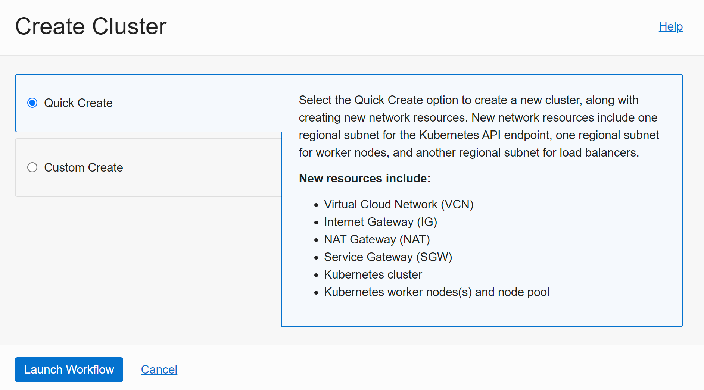
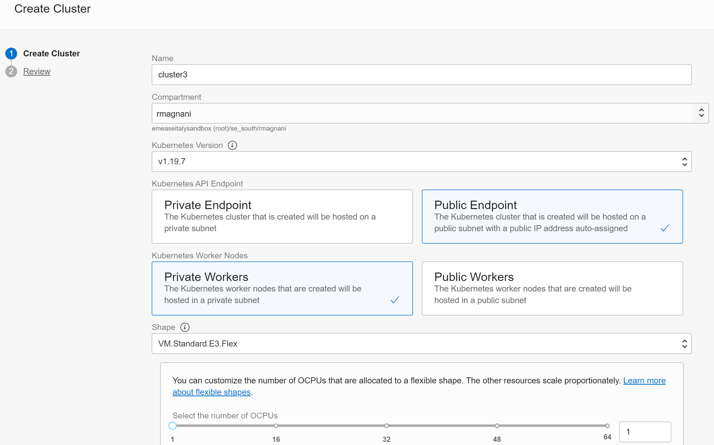

# Demo OKE

## Creazione di un cluster OKE con QuickStart

Ad esempio si usa il Quickstart per creare il cluster:

 

Poi si impostano le caratteristiche del cluster e si imposta una chiave pubblica per accedere ai nodi:

## Presentazione della struttura internal al cluster da console

## Collegamento al cluster da OCI Shell e da External sheel

## k9s

OCIR

## Istallazione dell'applicazione via helm

Clone del repository

Controllo dell'applicazione e visualizzazione dei componenti OCI

Stress test e Kubeview

Deploy / rollback / Probe

# Repository base

https://bitbucket.org/riccardo_magnani/sample-microservices-app/src/master/